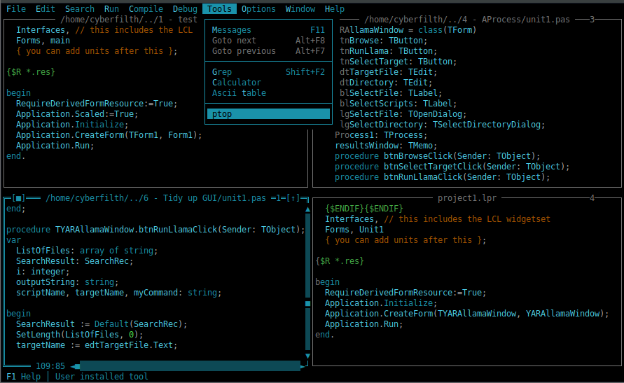

# FP-IDE-theme
Dark and cyan colour scheme for the Free Pascal IDE

To use this theme, either replace your local fp.ini file with this one, or copy and paste the [Colors] section into your own fp.ini file.

## Reference table
#### Use the below table for reference when amending this palette, or creating your own

<pre>
Index	Element
1	Desktop color, if all windows are closed and fp.ans is not available
2	Menu bar, normal menu elements
3	Menu unavailable greyed-out elements
4	Menu normal shortcut highlights
5	Menu selected item highlight
6	 Menu item (selected disabled)
7	Menu selected item shortcut highlight
8	 Debug 
9	 Debug 
10	 Debug 
11	 Debug 
12	 Debug 
13	 Debug 
24	Tools > Ascii table characters
25	Tools > Ascii table borders
26	 Ascii table border move and close window
32	Dialog tabs body
33	Dialog main body
34	Dialog border buttons
35	Dialog scroll bar trough
36	Dialog scroll bar arrows and thumb
37	Pop-up message text color
38	Dialog inactive group title
39	Dialog active group title
40	Dialog element shortcut highlight
41	Dialog inactive button
42	Dialog highlighted button, cursor is not on it
43	Dialog active button, cursor is on it
45	Dialog button shortcut highlight
46	Dialog button drop shadow
47	Dialog checkbox/radio button list
48	Dialog checkbox/radio button list selected item
49	Dialog checkbox/radio button list shortcut highlight
50	Dialog editable text field
51	Dialog editable text field selected text
52	 Dialog. indicator > Line contains more text
53	Dialog dropdown list arrow
54	Dialog dropdown list arrow brackets?
55	 Dialog. Drop down scroll bar
56	 Dialog. Drop down scroll bar arrows
57	 Dialog. Multi line text
58	 Dialog. Select one line of multi line text (active)
59	 Dialog. Select one line of multi line text (INactive)
60	 Dialog. separator line
61	 Dialog. info block
96	 Debug Watch border of inactive window / register watch inactive background
97	 Debug Watch border of active window
98	 Debug Watch border on move / close / minimize / maximize
99	 Debug Watch scroll bar arrows
100	 Debug Watch scroll bar arrows
101	 Debug Watch inactive line color (only Background)
102	 Debug Register view registers
121	 Debug Watch inactive line color (only Foreground)
121	 Help Scroll bar
122	 Debug Watch active line color
122	 Help Scroll bar arrows
160	 Help Body
161	 Help Link
162	 Help Link active
163	 Help Selected text (Background color only)
164	 Help border inactive
165	 Help border move / close / minimize / maximize
166	 Help border active
167	Editing window borders, inactive
168	Editing window borders, active
169	Editing window border buttons
170	Editing window scroll bar trough
171	Editing window scroll bar arrows and thumb
199	Code editor whitespace, offline
200	Code editor whitespace, inline
201	Code comments
202	Code reserved words (if, then, begin, end, function...)
203	Code identifiers (variable names, function names...)
204	Code string literals
205	Code numbers (decimal, &octal, %binary)
206	Assembly code
207	Code symbols (brackets, plus, minus, semicolon...)
208	Code editor selected text
211	Compiler directives
212	Code numbers (hexadecimal)
213	 Program edit window. Tab character color (background)
214	Code breakpoint line, compilation error message when going to error line
215	 Browse window border color for inactive window
216	Compilation messages window border
217	Compilation messages window border buttons
218	Compilation messages window scroll bar trough
219	Compilation messages window scroll bar arrows and thumb
220	 Browse window body top most item
223	Compilation messages window normal text
224	Compilation messages window highlighted row
225	 Browse item clicked
226	 Browse window body item
229	 Help Paragraph header level 0
230	 Help Paragraph header level 1
231	 Help Paragraph header level 2
232	 Help Paragraph header level 3
</pre>
